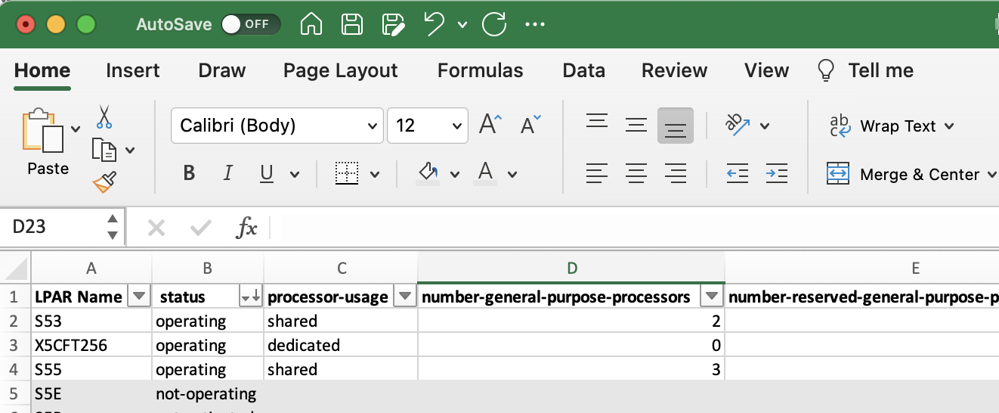

## Example-Audit-REXX

This samples goes to a CPC and lists the attributes, number of general-purpose CPs, zIIPs, storage etc...,for all **operating** LPARs. It then stores the results, which are in .csv format, in a z/OS data set member.  You can then import the content into Microsoft™ Excel or another application of your choice.

This samples uses **HWIREST API** to do the following:
- List CPCs and retrieves the URI and target name associated with that LOCAL CPC or the *CPCname* provided
- List the LPARs on that CPC
- For each LPAR that's in **operating** status, it retrieves the following information:
   - processor usage
   - number of GPP
   - number of reserved GPP
   - number of general purpose cores
   - number of reserved general purpose cores
   - number of ZIIP processors
   - number of reserved ZIIP processors
   - number of ZIIP cores
   - number of reserved ZIIP cores
   - number of ICF processors
   - number of reserved ICF processors
   - number of ICF cores
   - number of reserved ICF cores
   - number of IFL processors
   - number of reserved IFL processors
   - number of IFL cores
   - number of reserved IFL cores
   - initial processing weight
   - inition processing weight capped
   - initial VFM storage
   - maximum VFM storage
   - storage central allocation content
      - central type:
        - initial
        - current
      - reserved type:
        - initial
        - current
   - storage expanded current allocation

## System Prep work
- Store RXAUDIT1 into a data set
- Ensure your z/OS user ID has at least READ access to the following FACILITY Class Profiles
    - HWI.TARGET.netid.nau
    - HWI.TARGET.netid.nau.imagename

    <p>where netid.nau represents the 3– to 17– character SNA name of the particular CPC who's LPARs are being audited and imagename represents the 1– to 8- character LPAR name of all the LPARs available on that CPC </p>

- Allocate a partitioned data set that can hold the generated audit content
   - the longest lines generated is 697 characters long
   - minimum data set characteristics
     - RECFM: VB
     - LRECL: 701

## Invocation
**Syntax**:
```
  RXAUDIT1 -D outputDataSet [-C CPCname] [-I] [-V]
 ```
 where:
  - *-D outputDataSet*
      - **required**
      - *outputDataSet* is the name of an existing partitioned data set
      - if the LPAR(s) audit is successful, a member containing the audit
        information in a CSV format will be stored into the specified data set: *outputDataSet(memberName)*
      - name of data set member:
        - LOCAL, if LOCAL CPC was audited
        - CPCname, if a specific CPC was specified via the -C option
  - *-C CPCname*
      - **optional**
      - *CPCname* is the name of the CPC whos LPARs should be audit
      - **default if not provided:** LOCAL CPC
  - *-I*
      - **optional**
      - indicates this exec is being run in an ISV REXX environment
      - **default if not set:** TSO/E REXX environment
  - *–V*
      - **optional**
      - indicates additional tracing associated with JSON parsing should be turned on
      -**default if not set:** tracing excludes JSON specific tracing

**sample invocation in TSO:**
<br>RXAUDIT1 has been copied into data set HWI.HWIREST.REXX and HWI.RXAUDIT.OUTPUT
    has been allocated as RECFM=VB, LRECL=800
```
ex 'HWI.HWIREST.REXX(RXAUDIT1)' '-D HWI.RXAUDIT.OUTPUT'
```
 - exec is running in a TSO/E rexx environment and will audit LPARs on the LOCAL CPC
```
ex 'HWI.HWIREST.REXX(RXAUDIT1)' '-D HWI.RXAUDIT.OUTPUT -C T256 -I'
```
 - exec is running in an ISV rexx environment and will audit LPARs on CPC T256

**sample batch invocation via JCL:**
<br>RXAUDIT1 has been copied into data set HWI.HWIREST.REXX and HWI.RXAUDIT.OUTPUT
    has been allocated as RECFM=VB, LRECL=800

```
 //RXAUDIT1 JOB ,
 // CLASS=J,NOTIFY=&SYSUID,MSGLEVEL=1,
 //  MSGCLASS=H,REGION=0M,TIME=1440
 //STEP1    EXEC PGM=IKJEFT01,DYNAMNBR=20
 //SYSUDUMP DD SYSOUT=(H,,STD)
 //SYSTSPRT DD SYSOUT=(H,,STD)
 //SYSTSIN  DD * UB
 PROFILE NOPREFIX
 EX 'HWI.HWIREST.REXX(RXAUDIT1)' -
 '-D HWI.RXAUDIT.OUTPUT -C T115'
 /*
 ```
 - exec is running in a TSO/E rex environment and will audit LPARs on CPC T256

## Generated Output

 
 - Only LPARs in **operating** status are audited, to obtain information about non-operating LPARs,
   modify the exec to query the that LPAR's corresponding image activation profile instead of the
   LPAR itself. See **Get Image Activation Profile Properties** REST API operation in HMC Web Services API publication

- If one or more LPARs you expect to be in the list did not show up, ensure that
  1. Your USER ID has the appropriate access level to the FACILITY Class profile associated
     with that LPAR(s), see **System Prep Work** above
        - in this scenario, the SE will return those LPARs back to BCPii, but BCPii will
        remove them from the result due to lack of authorization
  2. Your local LPAR is allowed to use BCPii to access those LPAR's attributes
     [Setting BCPii firmware security access for each LPAR](https://www.ibm.com/docs/en/zos/2.5.0?topic=configuration-setting-bcpii-firmware-security-access-each-lpar)
       - in this scenario, the SE will NOT include those LPARs in the response back to BCPii