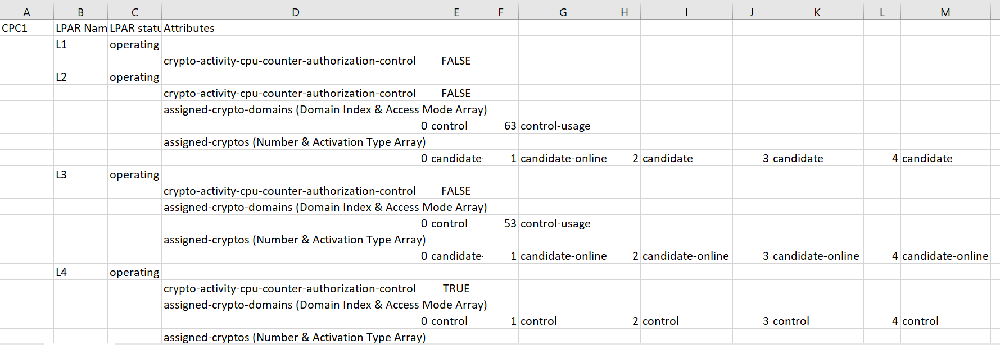

## Example-Crypto-REXX

This samples queries Image Activation profiles to list crypto attributes for LPARs. It stores the results, which are in .csv format, in a z/OS data set member.  You can import the content into Microsoft™ Excel or another application of your choice.

This sample uses **HWIREST API** to do the following:
- List CPCs and retrieve the URI and target name associated with the LOCAL CPC or the *CPCname* provided
- List the LPARs on the designated CPC and query the LPAR status.
- For each LPAR matching the requested status (default is operating), retrieve the following information:
     - crypto-activity-cpu-counter-authorization-control
     - assigned-crypto-domains
     - assigned-cryptos
- Note the crypto attributes are available on z16 or higher processors only.

## System Prep work
- Store RXCRYPT1 into a data set
- Ensure your z/OS user ID has at least READ access to the following FACILITY Class Profiles
    - HWI.TARGET.netid.nau
    - HWI.TARGET.netid.nau.imagename

    <p>where netid.nau represents the 3– to 17– character SNA name of the particular CPC whose LPARs are being queried and imagename represents the 1– to 8- character LPAR name, or * to represent all of the LPARs available on that CPC </p>

- Allocate a partitioned data set that can hold the generated content
   - the longest line generated depends on how many assigned-crypto-domains and assigned-cryptos are found
   - minimum data set characteristics
     - RECFM: VB
     - LRECL: 800

## Invocation
**Syntax**:
```
  RXCRYPT1 -D outputDataSet [-C CPCname] [-S Status] [-I] [-V]                                                 
 ```
 where:
  - *-D outputDataSet*
      - **required**
      - *outputDataSet* is the name of an existing partitioned data set
      - if the query is successful, a member containing the crypto
        information in a CSV format will be stored into the specified data set: *outputDataSet(memberName)* where the name of data set member is:
        - LOCAL, if the LOCAL CPC was used
        - CPCname, if a specific CPC was specified via the -C option
  - *-C CPCname*
      - **optional**
      - *CPCname* is the name of the CPC whose crypto info will be retrieved
      - **default if not provided:** LOCAL CPC
  - *-S Status*
      - **optional**
      - *Status* is the desired LPAR Status of the profiles to query 
      - Valid values:          
        - operating - query profiles for active/operating images  
        - not-operating - query profiles for active/not operating images                                                   
        - not-activated - query profiles for not activated images 
      - **default if not provided or if not valid:** operating                                               
  - *-I*
      - **optional**
      - indicates this exec is being run in an ISV REXX environment
      - **default if not set:** TSO/E REXX environment
  - *–V*
      - **optional**
      - indicates additional tracing associated with JSON parsing should be turned on
      - **default if not set:** tracing excludes JSON specific tracing

**sample invocation in TSO:**
<br>RXCRYPT1 has been copied into data set HWI.HWIREST.REXX and HWI.RXCRYPTO.OUTPUT
    has been allocated as RECFM=VB, LRECL=800
```
ex 'HWI.HWIREST.REXX(RXCRYPT1)' '-D HWI.RXCRYPTO.OUTPUT'
```
 - exec is running in a TSO/E rexx environment and will query the LOCAL CPC
```
ex 'HWI.HWIREST.REXX(RXCRYPT1)' '-D HWI.RXCRYPTO.OUTPUT -C T256'
```
 - exec is running in a TSO/E rexx environment and will query CPC T256
 ```
ex 'HWI.HWIREST.REXX(RXCRYPT1)' '-D HWI.RXCRYPTO.OUTPUT -C T256 -S not-activated'
```
 - exec is running in a TSO/E rexx environment, will query CPC T256 and query info for LPARs which are in not-activated status

**sample batch invocation via JCL:**
<br>RXCRYPT1 has been copied into data set HWI.HWIREST.REXX and HWI.RXCRYPTO.OUTPUT
    has been allocated as RECFM=VB, LRECL=800

```
 //RXCRYPT1 JOB ,
 // CLASS=J,NOTIFY=&SYSUID,MSGLEVEL=1,
 //  MSGCLASS=H,REGION=0M,TIME=1440
 //STEP1    EXEC PGM=IKJEFT01,DYNAMNBR=20
 //SYSUDUMP DD SYSOUT=(H,,STD)
 //SYSTSPRT DD SYSOUT=(H,,STD)
 //SYSTSIN  DD * 
 PROFILE NOPREFIX
 EX 'HWI.HWIREST.REXX(RXCRYPT1)' -
 '-D HWI.RXCRYPTO.OUTPUT -C T115'
 /*
 ```
 - exec is running in a TSO/E rexx environment and will query CPC T115

## Generated Output

 
 - If no query results show up, ensure that
  1. Your USER ID has the appropriate access level to the FACILITY Class profile associated with that CPC and images, see **System Prep Work** above.    
  2. Your local LPAR is allowed to use BCPii to access the CPC attributes
     [Setting BCPii firmware security access for each LPAR](https://www.ibm.com/docs/en/zos/2.5.0?topic=configuration-setting-bcpii-firmware-security-access-each-lpar)
  3. You are running on a z16 processor or higher.