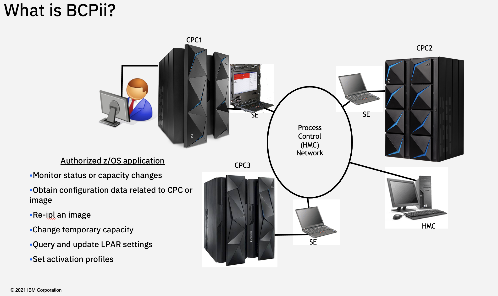

# zOS-BCPii
zOS Base Control Program internal interface

**Base Control Program internal interface (z/OS BCPii)**
- Allows authorized z/OS applications to have HMC-like control over systems in the process control (HMC) network.
- Does not use any external network; Communicates directly with the SE rather than going over an IP network.
- A z/OS address space that manages authorized interaction with the interconnected hardware.  

This repository contains samples that take advantage of new z/OS BCPii HWIREST interface to issue various requests against the CPC and more.  

<b>System Requirements for HWIREST invocation</b>
- minimum IBM Z15 hardware level for:
  - SE and HMC associated with the local and target CPC
- mimimum BCPii microcode level applied to the corresponding SE and HMC:
  - SE 2.15.0 with MCL P46598.370, Bundle S38
  - HMC 2.15.0 with MCL P46686.001, Bundle H25
- minimum BCPii level
  - z/OS 2.4 with APAR [**OA60351**](https://www.ibm.com/support/pages/apar/OA60351)

<b>HWIREST Interface Considerations</b>
- C, Assembler
  - Request Body maximum 64KB
  - Response Body maximum 15MB

- System/ISV REXX
  - Request Body maximum 64KB
  - Response Body maximum 2.5MB

- TSO/E REXX
  - Request Body maximum 32767 bytes
  - Response Body maximum 2.5MB

 [**Example-QueryInfo-REXX**](https://github.com/IBM/zOS-BCPii/tree/master/Example-QueryInfo-REXX)

This sample demonstrates how to use the BCPii HWIREST REXX interface to query CPC and LPAR information.

 [**Example-LPARActivate-C**](https://github.com/IBM/zOS-BCPii/tree/master/Example-LPARActivate-C)

This sample demonstrates how to use the BCPii HWIREST C interface to activate an LPAR and POLL to determine if the operation was successful.

  *Under Construction:* 
 **Example-LPARLoad-SystemRexx**

  <b>Publication References:</b>
- Syntax of HWIREST and other useful BCPii information: [**IBM z/OS MVS Programming: Callable Services for High-Level Languages**](https://www.ibm.com/support/knowledgecenter/SSLTBW_2.4.0/com.ibm.zos.v2r4.ieac100/uhmis.htm)
    - [**z/OS MVS Programming: Callable Services for High-Level Languages PDF**](https://www-01.ibm.com/servers/resourcelink/svc00100.nsf/pages/zOSV2R4sa231377?OpenDocument)

- Supported REST API operations: [**Hardware Management Console Web Services API, Appendix A, available on Resource Link:**](http://www.ibm.com/servers/resourcelink)   Library -> z15 -> Web Services API

- [**MVS System Management Facilities (SMF): BCPii SMF 106**](https://www.ibm.com/support/knowledgecenter/SSLTBW_2.4.0/com.ibm.zos.v2r4.ieag200/rec106.htm)
- [**MVS System Codes: BCPii System Code ‘042’X**](https://www.ibm.com/support/knowledgecenter/SSLTBW_2.4.0/com.ibm.zos.v2r4.ieah700/idg8313.htm)

  <b>Other useful references:</b>
- [**z/OS client web enablement toolkit: JSON Parser**](https://www.ibm.com/support/knowledgecenter/SSLTBW_2.4.0/com.ibm.zos.v2r4.ieac100/ieac1-cwe-json.htm)
- [**z/OS client web enablement toolkit github**](https://github.com/IBM/zOS-Client-Web-Enablement-Toolkit)
